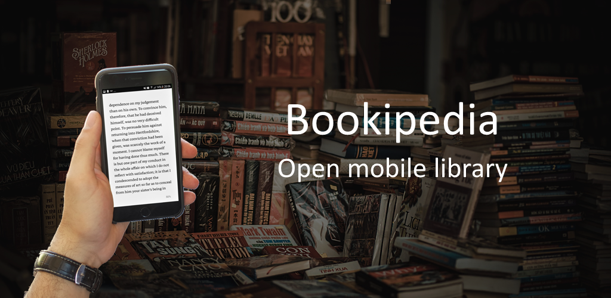
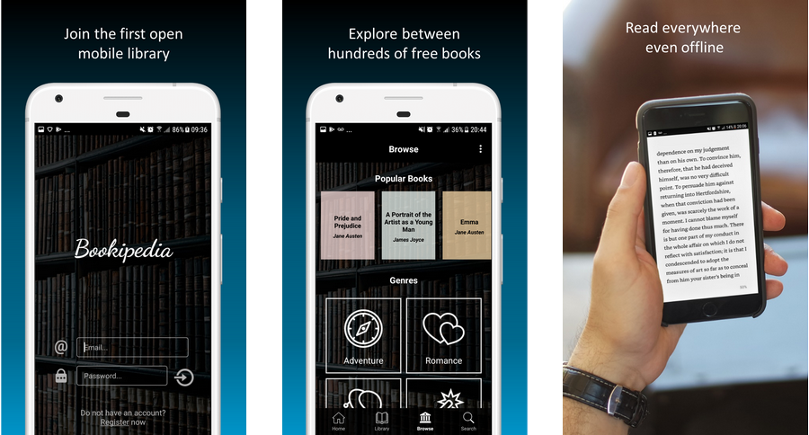

# Bookipedia

Bookipedia is an open source mobile library, download the Android app on the [Play Store](https://play.google.com/store/apps/details?id=com.gcappslab.bookipedia). We believe that culture should be open and accessible to everyone, therefore we offer you a completely free app where you can read hundreds of books.

- Unlimited Reading — Choose from hundreds classics books we legally offer you.

- Read Books for Free — All books are completely free and without ads. 

- Read Books Anywhere — Bookipedia allows you to download any book and access it offline. You can also read the same book across multiple devices with automatic synchronization. 

- Read Books as you Like — Choose your favorite font, dimension, background color and orientation.

For documentation read [this file](documentation/docs.pdf). If you are interested in the project and/or you want to contribute, feel free to write me at gcappslab@gmail.com. 

  

  

